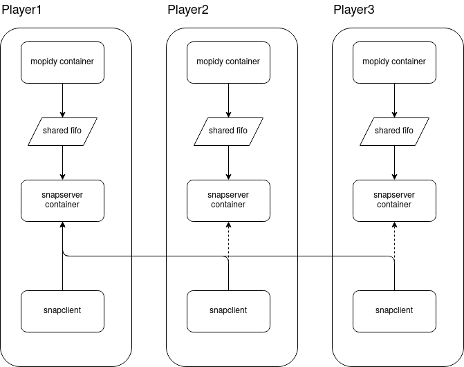

# musicserver

this is a bit of glue to combine mopidy and snapcast into an easy-to-use and versatile combination for implementing open source multi-room audio. the basic idea is to have each player run a mopidy and a snapserver instance alongside the snapclient. mopidy and snapserver don't directly interact with the hardware, so they can be easily containerized - as long as you can run docker on your SBC, you should be able to run these two. 

snapclient is not running containerized (yet), since it needs an audiostack to work. this might change in the future.

in the "setup" folder, you will find scripts to setup all dependencies on top of a minimal raspbian or armbian image, including docker and docker-compose. these setup scripts also configure the avahi daemon to announce the presence of the snapcast.

i will be adding a process on the host that looks at zeroconf, provides an api to change snapclient - to server relationships and thus allow on-the fly regrouping. this is WIP. just putting it out there.

